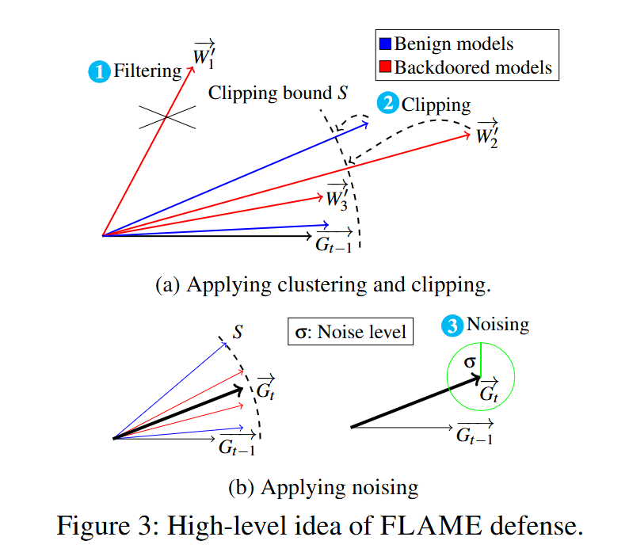

# 基于一致性的非定向模型投毒攻击

## 数据处理
- **数据集**：Cifar10、FashionMNIST
- **数据划分**：IID：balance。Non-IID：pat、dir、exdir、spdir

## 攻击方法设计
- 理想全局更新：$g^{(t)}=\mathcal{A}\left(g_1{ }^{(t)}, g_2{ }^{(t)} \cdots, g_m{ }^{(t)}, g_{m+1}{ }^{(t)}, \cdots, g_n{ }^{(t)}\right)$
- 扰动因子：$\delta^{(t)}$ （单位向量）
- 恶意更新：$g^{\prime(t)}=g^{(t)}+\lambda \delta^{(t)}$
- 保持一致性的方法：
  * 保持 $\delta^{(t)}$ 各维度参数符号不变
  * 保持 $g^{\prime(t)}$ 各维度参数符号不变

## 用于对比的攻击方法
- Sign-flipping: 翻转本地更新的符号
- LIE(A little is enough)：使用与 $g^{(t)}$ 方向相反的单位向量作为扰动因子
- Min-Max：使用各维度相等的单位向量作为扰动因子
- Random：使用高斯分布生成随机的更新
- PoisonedFL：事先选取随机的方向向量，用该向量对理想全局更新做mask

## 用于检验的防御方法
- Multi-Krum: Kurm得分最少的若干个更新做平均
- Median：取所有更新各维度参数的中位数
- Trmean：取所有更新各维度的截尾平均数
- FLAME：根据本地模型的余弦相似度进行聚类
- FLCERT：将客户端分成多个组进行组内训练，取多数投票结果作为模型输出

## 初步实验结果
Cifar10

| Attack    | FedAvg | Multi-Krum | Median | TrMean | FLAME | FLCert|
|-----------|--------|------------|--------|--------|-------|-------|
| no attack | 65.84 | 59.52      | 65.01  | 66.2    | 65.24 | 66.14 
| sign-flip | -     | 60.07      | 52.57  | 59.79   | 65.01 |
| LIE       | 62.24 | 59.74      | 60.54  | 61.77   | 66.39 |
| Min-Max   | 52.37 | **50.25**  | **47.85**  | 51.82   | 64.18 |
| Random    | 54.71 | 60.21      | 62.1  | 64.71    | 64.09  |
| PoisonedFL| **46.36** | 51.9   | 61.23  | 64.7    | 64.5  |
| ours      | 47.72 | 50.94      | 47.87  | **47.63**   | **61.29** |

FashionMNIST

| Attack    | FedAvg | Multi-Krum | Median | TrMean | FLAME | FLCert|
|-----------|--------|------------|--------|---------|-------|-------|
| no attack | 85.33  | 84.91      | 83.22  | 84.5    | 84.72 | 85.31 
| sign-flip | -      | 80.19      | 72.93  | 77.16   | 84.11 |
| LIE       | 81.44  | 80.13      | 81.54  | 81.35   | 81.97 |
| Min-Max   | 72.98  | **71.4**    | **70.27**  | 72.18   | 72.09 |
| Random    | 75.26  | 79.65   | 76.24  | 77.87    | 82.4  |
| ours      |**69.26**| 72.38 | 70.67  | **69.24**   | **70.01** |

## 考虑不同的威胁模型
攻击者的先验知识：服务器使用的安全聚合算法、良性客户端上传的更新\
agr-updates： $g^{(t)}=\mathcal{A}\left(g_1{ }^{(t)}, g_2{ }^{(t)} \cdots, g_m{ }^{(t)}, g_{m+1}{ }^{(t)}, \cdots, g_n{ }^{(t)}\right)$\
agr-only： $g^{(t)}=\mathcal{A}\left(g_1{ }^{(t)}, g_2{ }^{(t)} \cdots, g_m{ }^{(t)}\right)$\
updates-only： $g^{(t)}=\mathcal{mean}\left(g_1{ }^{(t)}, g_2{ }^{(t)} \cdots, g_m{ }^{(t)}, g_{m+1}{ }^{(t)}, \cdots, g_n{ }^{(t)}\right)$\
agnostic： $g^{(t)}=\mathcal{mean}\left(g_1{ }^{(t)}, g_2{ }^{(t)} \cdots, g_m{ }^{(t)}\right)$

| Attack    | FedAvg | Multi-Krum | Median | TrMean |
|-----------|--------|------------|--------|---------|
| agr-only | 52.84 | 55.31 | 57.8 | 53.58 | 
| updates-only | 55.73 | 57.24 | 56.17 | 55.92 |
| agnostic | 60.88 | 60.17 | 61.14  | 60.37 | 
| agr-updates | 47.72 | 50.94 | 47.87  | 47.63 | 

## 可以进一步考虑的事情
服务器：对收集到的客户端更新进行裁剪，将更新的大小控制在指定阈值$S$内\
攻击者：已知服务器会进行梯度裁剪，尝试预估阈值$S$，从而通过放缩规避检测的同时达到尽可能大的攻击效果

$w^t$：第 $t$ 轮的全局模型\
$g^t=w^{t-1}-w^{t-2}$：第 $t-1$ 轮的全局更新\
用 $\lambda*g^t$ 计算放缩后更新的大小，增大 $\lambda$ 可以提高攻击性，减小 $\lambda$ 可以提高隐蔽性

如何调整 $\lambda$：如果上轮有比较多的恶意更新被过滤了，那么 $\lambda$ 就是偏大的，本轮需要减小

判断恶意更新是否被过滤：

根据 $w^{t-1}$ 的测试集准确率判断：攻击是为了降低模型准确率，如果最近几轮模型准确率没有降低，说明恶意更新可能被过滤了

考虑恶意更新的构造方式：$g^{\prime(t)}=g^{(t)}+\lambda \delta^{(t)}$\
比较 $g^{t-1}-g^{(t-1)}$ 与 $\delta^{(t)}$ 的符号相似度，相似度越大，我们可以认为上一轮攻击越有效\
当相似度较高时，上一轮攻击成功了，考虑增大 $\lambda$ 提高攻击性
当相似度较低时，上一轮攻击不奏效，考虑减小 $\lambda$ 提高隐蔽性
